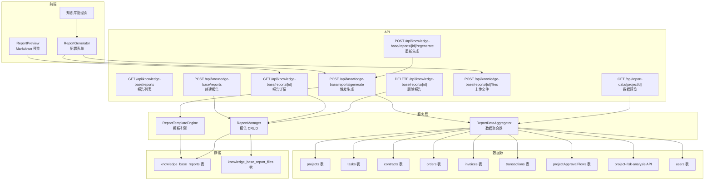

# Technical Design - 智能报告生成模块

Feature Name: smart-report-generator
Updated: 2026-06-20

## Description

在知识库模块新增智能报告生成功能。前端提供配置表单（项目选择/日期/描述/文件上传）；后端聚合 9 个系统模块数据，按预设 Markdown 模板生成综合项目报告；支持预览、复制、下载、历史管理。报告生成采用纯数据填充模式，基于固定模板章节自动完成。

## Architecture



**数据流**:
1. 用户配置 → 上传文件（POST /files）→ 文件存入 S3，记录写入 `knowledge_base_report_files`
2. 用户点击生成 → POST /generate → ReportDataAggregator 并行拉取 9 个数据源 → ReportTemplateEngine 填充模板 → 报告写入 `knowledge_base_reports` → 返回报告 ID
3. 前端获取报告 → GET /[id] → 返回 Markdown 内容 → ReportPreview 渲染

## Components and Interfaces

### 前端组件

| 组件 | 文件 | 职责 |
|------|------|------|
| `ReportGenerator` | `src/components/ReportGenerator.tsx` | 报告配置与生成主入口，含配置表单和报告列表 tabs |
| `ReportConfigForm` | `src/components/ReportConfigForm.tsx` | 项目选择器、日期范围、描述输入、文件上传、提交按钮 |
| `ReportPreview` | `src/components/ReportPreview.tsx` | Markdown 渲染展示（react-markdown）、复制/下载/重新生成操作 |
| `ReportFileUploader` | `src/components/ReportFileUploader.tsx` | 拖拽/点击上传、进度条、文件列表管理、删除 |

### API 接口

| 方法 | 路径 | 认证 | 说明 |
|------|------|------|------|
| GET | `/api/knowledge-base/reports` | required | 报告列表，支持 `?projectId=` `?page=` `?pageSize=` `?dateFrom=` `?dateTo=` |
| POST | `/api/knowledge-base/reports/generate` | required | 触发报告生成，body: `{ projectId, dateFrom, dateTo, description, fileIds }` |
| GET | `/api/knowledge-base/reports/[id]` | required | 获取报告详情（含 Markdown 内容 + 文件列表） |
| DELETE | `/api/knowledge-base/reports/[id]` | required | 删除报告及其关联文件记录 |
| POST | `/api/knowledge-base/reports/[id]/regenerate` | required | 使用相同参数重新拉取数据生成新报告 |
| POST | `/api/knowledge-base/reports/[id]/files` | required | 上传参考文件（multipart），限制 10MB/文件，10 个/报告 |
| GET | `/api/report-data/[projectId]` | required | 预览项目数据聚合结果（调试用，返回各模块原始数据） |

### 服务层

**ReportDataAggregator** (`src/lib/report-aggregator.ts`)
```typescript
interface AggregatedData {
  project: ProjectInfo;
  tasks: TaskStats;
  contracts: ContractSummary;
  orders: OrderSummary;
  invoices: InvoiceSummary;
  transactions: TransactionSummary;
  approvals: ApprovalStats;
  risks: RiskAnalysis;
  team: TeamMember[];
}

interface ProjectInfo {
  id: string; name: string; description: string; status: string;
  manager: string; startDate: string; endDate: string;
}

interface TaskStats {
  total: number; completed: number; inProgress: number;
  overdue: number; completionRate: string;
  details: { title: string; status: string; assignee: string; dueDate: string }[];
}

interface ContractSummary {
  totalCount: number; totalAmount: number; paidAmount: number;
  pendingAmount: number; collectionRate: string;
}

interface OrderSummary {
  totalCount: number; totalAmount: number;
  byStatus: Record<string, number>;
}

interface InvoiceSummary {
  invoices: { number: string; amount: number; date: string; status: string }[];
  totalAmount: number;
}

interface TransactionSummary {
  totalIncome: number; totalExpense: number; balance: number;
}

interface ApprovalStats {
  approved: number; pending: number; rejected: number; total: number;
}

interface RiskAnalysis {
  total: number; high: number; medium: number; low: number;
  details: { type: string; level: string; description: string; suggestion: string }[];
}

interface TeamMember {
  name: string; role: string; department: string;
}
```

**ReportTemplateEngine** (`src/lib/report-template-engine.ts`)
- `generateMarkdownReport(data: AggregatedData, config: ReportConfig): string`
- 返回完整 Markdown 字符串，按固定模板填充

### 报告模板结构

```markdown
# [项目名称] - 项目综合报告

**报告期间**: 2026-01-01 至 2026-06-20
**生成日期**: 2026-06-20
**生成人**: 张三

---

## 前言

[用户输入的描述文本]

---

## 一、项目概况

| 属性 | 值 |
|------|-----|
| 项目名称 | XXX |
| 项目状态 | 进行中 |
| 负责人 | 李四 |
| 开始日期 | 2026-01-01 |
| 预计完成 | 2026-12-31 |
| 项目描述 | ... |

## 二、任务进度分析

- 总任务数: 45
- 已完成: 30 (66.7%)
- 进行中: 12 (26.7%)
- 已延期: 3 (6.7%)

[延期任务详情表格]

## 三、合同与订单汇总

[合同汇总卡片]
[订单状态分布表格]

## 四、财务收支概览

[收款/付款柱状或数值卡片]
[发票明细表格]

## 五、审批流转统计

[饼图数据文本描述]
[审批状态分布]

## 六、风险分析

[风险等级分布]
[高风险项明细]

## 七、团队与资源

[团队成员表格]

## 八、参考文件

[文件列表和下载链接]

---

*报告由系统自动生成*
```

## Data Models

### knowledge_base_reports 表

| 字段 | 类型 | 约束 | 说明 |
|------|------|------|------|
| id | varchar(36) | PK, default gen_random_uuid() | 主键 |
| title | varchar(500) | NOT NULL | 报告标题（自动生成） |
| project_id | varchar(36) | FK → projects.id, SET NULL | 关联项目 |
| content | text | NOT NULL | Markdown 格式报告内容 |
| config | jsonb | NOT NULL DEFAULT '{}' | 生成配置：{dateFrom, dateTo, description} |
| created_by | varchar(36) | FK → users.id, SET NULL | 生成人 |
| created_at | timestamptz | NOT NULL DEFAULT NOW() | 生成时间 |
| updated_at | timestamptz | | 更新时间 |

索引: `reports_project_id_idx`, `reports_created_at_idx`, `reports_created_by_idx`

### knowledge_base_report_files 表

| 字段 | 类型 | 约束 | 说明 |
|------|------|------|------|
| id | varchar(36) | PK, default gen_random_uuid() | 主键 |
| report_id | varchar(36) | FK → knowledge_base_reports.id, CASCADE | 关联报告 |
| file_name | varchar(500) | NOT NULL | 原始文件名 |
| file_url | text | | 文件访问链接 |
| file_size | varchar(20) | | 文件大小(bytes) |
| file_type | varchar(100) | NOT NULL | MIME 类型 |
| uploaded_by | varchar(36) | FK → users.id, SET NULL | 上传人 |
| created_at | timestamptz | NOT NULL DEFAULT NOW() | 上传时间 |

索引: `report_files_report_id_idx`

### Zod 校验 Schema

```typescript
export const insertReportSchema = createInsertSchema(knowledgeBaseReports, {
  config: z.object({
    dateFrom: z.string(),
    dateTo: z.string(),
    description: z.string().optional(),
  }),
});
```

## Correctness Properties

1. **幂等性**: 同一用户同一项目相同配置多次生成，每次产生独立记录，不覆盖历史。
2. **数据一致性**: 报告内容基于生成时刻的系统数据快照，后续数据变更不影响已有报告。
3. **部分容错**: 单个数据源拉取失败不影响其他章节生成，失败章节标注「数据获取失败」。
4. **引用完整性**: 删除报告时 CASCADE 删除关联文件记录，文件保留在 S3（软清理由定时任务处理）。
5. **权限校验**: 用户只能为自己有权限的项目生成报告。

## Error Handling

| 场景 | 处理策略 |
|------|----------|
| 项目不存在 | 返回 404，提示「项目不存在或无权访问」 |
| 数据源查询超时 (>5s) | 该章节标记「数据获取超时」，继续处理其余章节 |
| 文件上传超 10MB | 返回 413，提示「文件大小不能超过 10MB」 |
| 单次报告文件数超 10 | 返回 400，提示「最多上传 10 个文件」 |
| 模板生成异常 | 返回 500，记录错误日志，不返回半成品 |
| 并发生成同一项目报告 | 允许，每次独立生成 |
| 未登录/Token 过期 | 返回 401 |

## Test Strategy

1. **数据聚合层单元测试**: 模拟各数据源返回，验证 Aggregator 对空数据、异常数据的处理。
2. **模板引擎单元测试**: 输入 fixture 数据，验证输出的 Markdown 结构完整。
3. **API 集成测试**: 使用测试项目数据，调用 generate API，验证响应格式和数据库写入。
4. **前端组件测试**: 验证 ReportConfigForm 表单校验逻辑，ReportPreview Markdown 渲染。
5. **边界测试**: 空数据项目报告、超大金额、超长描述文本、特殊字符处理。

## References

- `src/storage/database/shared/schema.ts#L1558` - knowledge_base 表定义
- `src/storage/database/knowledgeBaseManager.ts` - 知识库 Manager 模式参考
- `src/components/KnowledgeBaseManagement.tsx` - 知识库管理组件参考
- `src/app/api/knowledge-base/route.ts` - 知识库 API 路由参考
